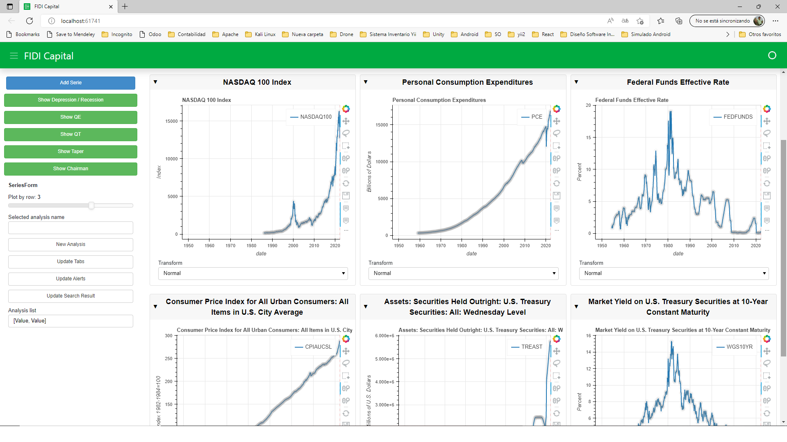
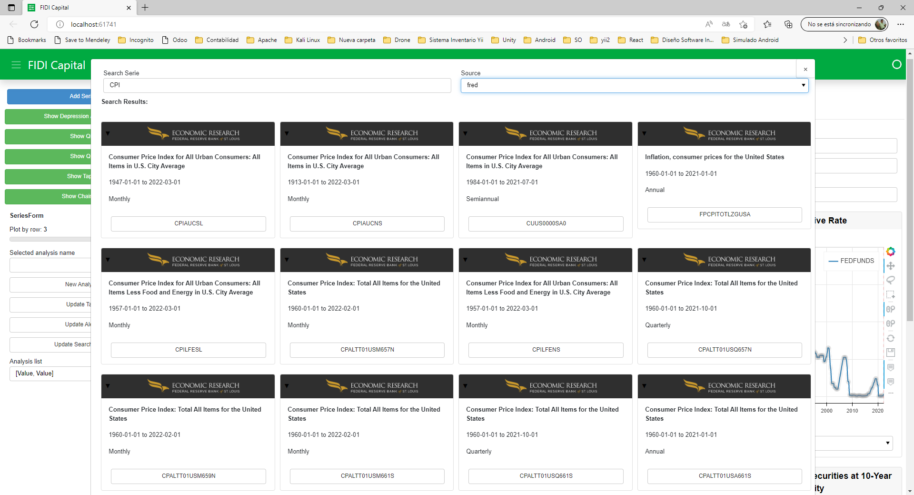

# Dashboard of Economic Data Analysis

This dashboard integrate different economic sources letting you add the desired time serie to be analysis.

The data sources integrated are:

* [Federal Reserve](https://fred.stlouisfed.org) - Economic Research from Federal Reserve of St. Louis
* [Nasdaq Data Link](https://data.nasdaq.com) - A premier source for financial, economic and alternative datasets.

Additonally, you could integrate data series from CSV Files.

## Screenshots





## Getting Started

These instructions will get you a copy of the project up and running on your local machine for development and testing purposes.

### Installing

1. Create a new virtual environment with your prefered tools
```
python -m venv env
```
2. Copy the repositiory https://github.com/jairotunior/dashboard_tutorial.git
3. Install the dependencies

```
pip install -r requirements.txt
```
4. Get the API Key from Economic Research of Federal Reserve of St. Louis (https://fred.stlouisfed.org) and save the API Key in a file called 'api_fred.txt' in the root of the project.
5. Get the API Key from Nasdaq Data Link (https://data.nasdaq.com/tools/api) and put the API KEY in the variable quandl_api_key in run_dashboard.py file.
6. Now run the dashboard with:
```
python run_dashboard.py
```


That's all for use.

## Built With

* [Pandas](https://pandas.pydata.org) - pandas is a fast, powerful, flexible and easy to use open source data analysis and manipulation tool
* [Numpy](http://www.numpy.org/) - Is the fundamental package for scientific computing with Python.
* [Python](https://www.python.org/) - The most amazing Programming Language.
* [Panel](https://panel.holoviz.org) - Panel is an open-source Python library that lets you create custom interactive web apps and dashboards

## License

This project is licensed under the MIT License - see the [LICENSE.md](LICENSE.md) file for details
